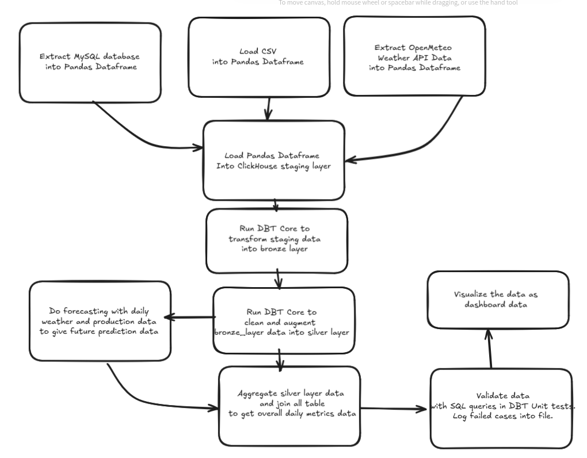

<h1>
Coal Mining ETL Pipeline
</h1>

A coal mining company aims to optimize its mining operations using their production data. They also want to integrate external factors to further optimize analysis and build predictive analytic models in the form of forecasting. To solve that problem, the provided solution has to implement a unified data warehouse that collects data from various sources and transforms them with ETL/ELT pipeline so that the information can be presented as BI dashboards to help stakeholders devise strategic decisions for the coal mining company.

Main Document Report: [Link](Synapsis%20-%20Coal%20Mining%20ELT%20Pipeline%20and%20Data%20Warehouse%20Report%20-%20Karunia%20Perjuangan%20M.pdf)

### Tutorial

1. Run `docker compose build`
2. Run `init.sh` to initialize docker compose
3. Copy .env.example to .env
4. Run `docker compose up`
5. Rim coal_mining_dag
6. Access metabase dashboard in localhost:3000

### Architecute Diagram

### Dashboard Report Example

### Flowchart Example
